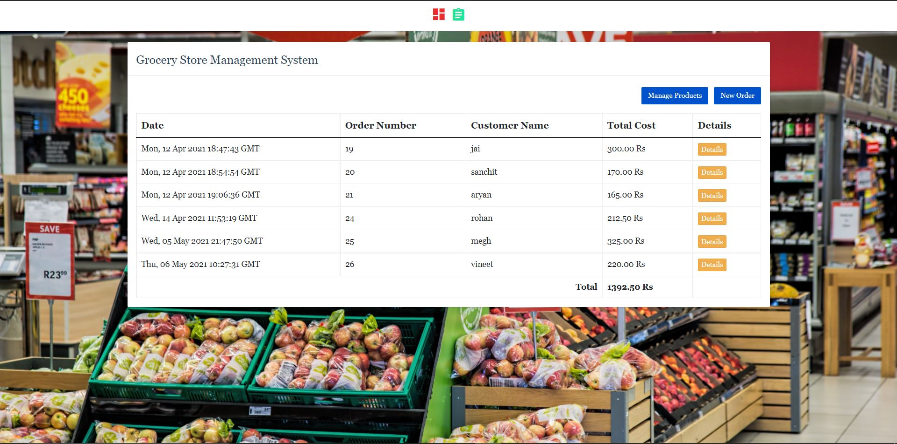

# python_projects_grocery_webapp
In this python project, we will build a grocery store management application. It will be 3 tier application,
1. Front end: UI is written in HTML/CSS/Javascript/Bootstrap
2. Backend: Python and Flask
3. Database: mysql



### Installation Instructions

Download mysql for windows: https://dev.mysql.com/downloads/installer/

`pip install mysql-connector-python`


# Grocery Store Database Setup

## Overview

These are instructions for setting up the grocery_store database along with sample data using SQL scripts.

## Setup Instructions

1. Create the `grocery_store` database:

```sql
CREATE DATABASE IF NOT EXISTS grocery_store;
```

2. Switch to the `grocery_store` database:

```sql
USE grocery_store;
```

3. Create the `uom` (unit of measure) table:

```sql
CREATE TABLE IF NOT EXISTS uom (
    uom_id INT AUTO_INCREMENT PRIMARY KEY,
    uom_name VARCHAR(50)
);
```

4. Insert demo data into the `uom` table:

```sql
INSERT INTO uom (uom_name) VALUES
('Piece'),
('Kilogram'),
('Liter');
```

5. Create the `products` table:

```sql
CREATE TABLE IF NOT EXISTS products (
    product_id INT AUTO_INCREMENT PRIMARY KEY,
    name VARCHAR(255),
    uom_id INT,
    price_per_unit DECIMAL(10, 2),
    FOREIGN KEY (uom_id) REFERENCES uom(uom_id)
);
```

6. Insert demo data into the `products` table:

```sql
INSERT INTO products (name, uom_id, price_per_unit) VALUES
('Apples', 1, 1.99),
('Milk', 3, 2.49),
('Bread', 1, 3.99);
```

7. Create the `orders` table:

```sql
CREATE TABLE IF NOT EXISTS orders (
    order_id INT AUTO_INCREMENT PRIMARY KEY,
    customer_name VARCHAR(255),
    total DECIMAL(10, 2),
    datetime DATETIME
);
```

8. Insert demo data into the `orders` table:

```sql
INSERT INTO orders (customer_name, total, datetime) VALUES
('Rudraprasad Mohapatra', 15.97, NOW()),
('Rajarudra Mohapatra', 8.98, NOW());
```

9. Create the `order_details` table with `ON DELETE CASCADE`:

```sql
CREATE TABLE IF NOT EXISTS order_details (
    order_detail_id INT AUTO_INCREMENT PRIMARY KEY,
    order_id INT,
    product_id INT,
    quantity INT,
    total_price DECIMAL(10, 2),
    FOREIGN KEY (order_id) REFERENCES orders(order_id),
    FOREIGN KEY (product_id) REFERENCES products(product_id) ON DELETE CASCADE
);
```

10. Insert demo data into the `order_details` table:

```sql
INSERT INTO order_details (order_id, product_id, quantity, total_price) VALUES
(1, 1, 2, 3.98),
(1, 2, 1, 2.49),
(2, 3, 1, 3.99);
```

That's it! You have successfully set up the `grocery_store` database with sample data.

### Exercise 

The grocery management system that we built is functional but after we give it to users for use, we got following feedback. The exercise for you to address this feedback and implement these features in the application,
1. **Products Module**: In products page that lists current products, add an edit button next to delete button that allows to edit current product
2. **Products Module**: Implement a new form that allows you to add new UOM in the application. For example you want to add **Cubic Meter** as a new UOM as the grocery store decided to start selling **wood** as well. This requies changing backend (python server) and front end (UI) both.
3. **Orders Module**: When you place an order it doesn't have any validation. For example one can enter an order with empty customer name. You need to add validation for customer name and invalid item name or not specifying a quantity etc. This is only front end UI work.
4. **Orders Module**: In new order page there is a bug. When you manually change total price of an item it doesn't change the grand total. You need to fix this issue.
5. **Orders Module**: In the grid where orders are listed, add a view button in the last column. On clicking this button it should show you order details where individual items in that order are listed along with their price/quantity etc.

